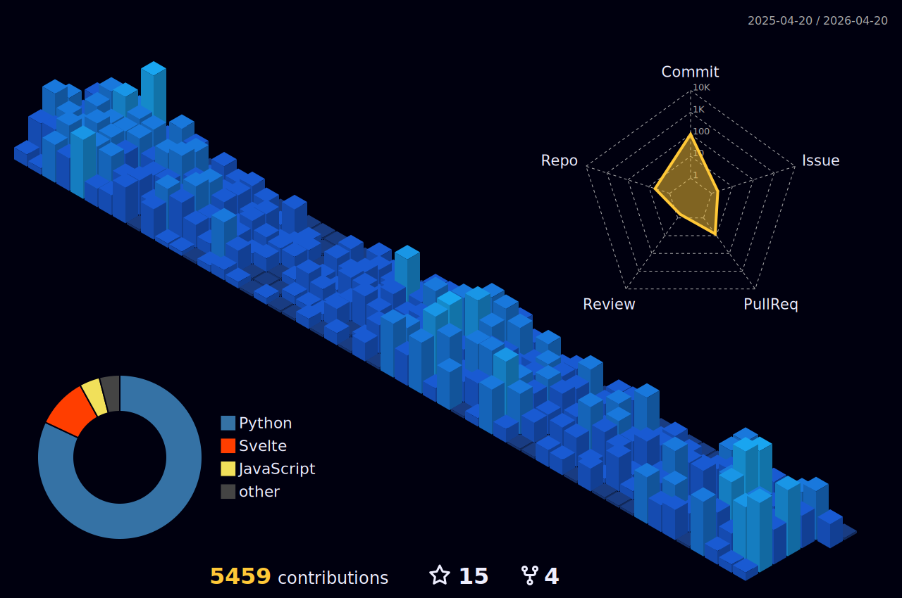

<h1 align="center">Hi 👋, I'm Pratik Bhadane!</h1>
<h3 align="center">Chief Technology Officer & FinTech Architect 🚀</h3>

  

 

### 👨🏻‍💻 About Me

- 🔭 I’m currently scaling operations and building high-frequency trading microservices.
- 🌱 I’m currently deep-diving into **Rust, Pingora, and WebAssembly** for low-latency execution.
- 👯 I'm open to collaborating on **Open Source FinTech & Quantitative Analysis tools** like `ferro-ta`.
- 💬 Ask me about **FastAPI, Rust, SvelteKit, Kubernetes, and globally distributed proxy routing**.
- 📫 Reach me at: **[pratikbhadane24@gmail.com](mailto:pratikbhadane24@gmail.com)**.

 

### 🏆 Featured Architecture & Open Source

  

 

### 🛠️ Tech Stack & Tools

  

 

### 📊 GitHub Analytics

  

<picture>
  <source media="(prefers-color-scheme: dark)" srcset="https://raw.githubusercontent.com/pratikbhadane24/pratikbhadane24/output/github-contribution-grid-snake-dark.svg">
  <source media="(prefers-color-scheme: light)" srcset="https://raw.githubusercontent.com/pratikbhadane24/pratikbhadane24/output/github-contribution-grid-snake.svg">
</picture>

 

  

 

<h3 align="center">🤝 Connect with me:</h3>

  
  

